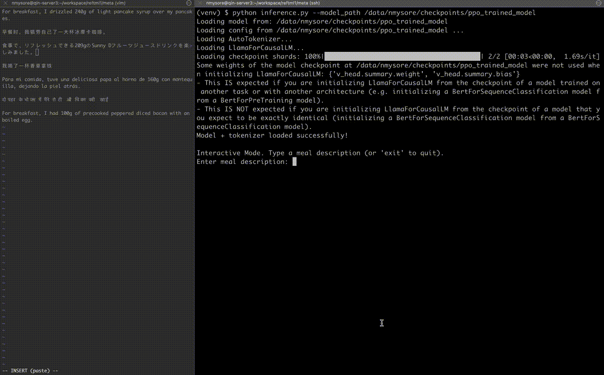

# ReFT-PPO: SFT-Warmup + PPO for Better Reasoning

## 1) What is this?
This project fine-tunes a text-only LLM in two stages:

- **Stage A — SFT (Supervised Fine-Tuning):** warm up a *reasoning path* by training on prompts with chain-of-thought (CoT) and a final numeric answer.
- **Stage B — PPO (Reinforcement Learning):** start from the SFT checkpoint and optimize generations with **PPO** (Proximal Policy Optimization), using:
  - a **numeric reward** measuring closeness to the ground-truth answer,
  - an optional **KL penalty** to stay close to the reference model,
  - **token-level** value head and advantage estimation.

The repo includes GPT-2 and LLaMA-style pipelines, left-padding for decoder-only models, and robust tokenizer handling for special CoT markers: `<|begin_cot|>` … `<|end_cot|>`.

This demo shows improved reasoning paths and ability to handle multiple languages post training.


## 2) Quickstart (TL;DR)
```bash
# 0) Environment
conda create -n reftppo python=3.10 -y
conda activate reftppo
pip install -U torch transformers accelerate trl datasets wandb numpy

# 1) Prepare data (see format below)
#    Put JSON files at: data/train_data.json and data/test_data.json

# 2) SFT: warm up reasoning (choose one)
# 2a) Generic (GPT-2 or LLaMA by name)
python sft.py --base_model_name meta-llama/Llama-3.2-3B-Instruct --train_file data/train_data.json --test_file data/test_data.json --output_dir warmed_up_model --epochs 1 --batch_size 4 --learning_rate 2e-5 --data_fraction 0.1

# 2b) LLaMA-3.2-3B recipe (under metalama3b/)
python metalama3b/sft.py --train_file data/train_data.json --test_file data/test_data.json --output_dir fine_tuned_model --epochs 1 --batch_size 4 --learning_rate 2e-5 --data_fraction 0.1

# 3) PPO: improve reasoning with rewards (start from SFT checkpoint)
python reft.py --warm_start_model warmed_up_model --base_model_name meta-llama/Llama-3.2-3B-Instruct --train_file data/train_data.json --n_epochs 3 --batch_size 1 --max_new_tokens 400 --do_sample True --kl_coef 0.02 --lr 5e-7 --value_lr 1e-7 --output_dir ppo_trained_model

# (Alternative LLaMA-3.2-3B script with extra logging)
python metalama3b/reft.py --warm_start_model fine_tuned_model --train_file data/train_data.json --n_epochs 3 --batch_size 4 --max_new_tokens 400 --do_sample True --kl_coef 0.02 --lr 5e-7 --value_lr 1e-7 --start_temp 2.0 --end_temp 0.2 --output_dir checkpoints/ppo_trained_model

# 4) Inference (LLaMA pipeline example)
python metalama3b/inference.py --model_path ppo_trained_model --max_new_tokens 300
```

## 3) Data format
Use JSON lists with the following fields:

```json
[
  {
    "question": "Two slices of whole-wheat bread with peanut butter.",
    "answer_cot": "Estimate grams per slice ... total carbs ... <34>",
    "answer_value": 34
  }
]
```

- **Required:** `question`, `answer_value`
- **Optional:** `answer_cot`
- The training code wraps samples with LLaMA-style prompts and CoT markers.

## 4) Repo structure
```
.
├── sft.py
├── reft.py
├── metalama3b/
│   ├── sft.py
│   ├── reft.py
│   ├── inference.py
│   └── prompt_manager.py
├── src/
│   ├── prompt_manager.py
│   ├── data_manager.py
│   └── ppo/
│       ├── base_model.py
│       ├── policy_value.py
│       └── ppo_trainer.py
└── data/
    ├── train_data.json
    └── test_data.json
```

## 5) Requirements
Python ≥ 3.9  
Install: `torch transformers accelerate trl datasets wandb numpy`

## 6) Stage A — Supervised Fine-Tuning (SFT)
Trains model on question–answer pairs with reasoning traces.

## 7) Stage B — PPO Fine-Tuning
Improves reasoning via reward optimization with KL regularization.

## 8) Inference
After PPO, test interactively:
```bash
python metalama3b/inference.py --model_path ppo_trained_model --max_new_tokens 300
```

## 9) Reproduce end-to-end
SFT → PPO → Inference (see sections 2 and 8)

## 10) Notes
- Left padding enabled for decoder-only LMs.
- `<|begin_cot|>` and `<|end_cot|>` tokens auto-added.
- PPO rewards: Gaussian closeness to numeric answer.
- KL penalty prevents catastrophic drift.
- Supports multi-GPU via Hugging Face Accelerate.

## 11) Citation
Built on Hugging Face Transformers, TRL, Accelerate, and Datasets.
